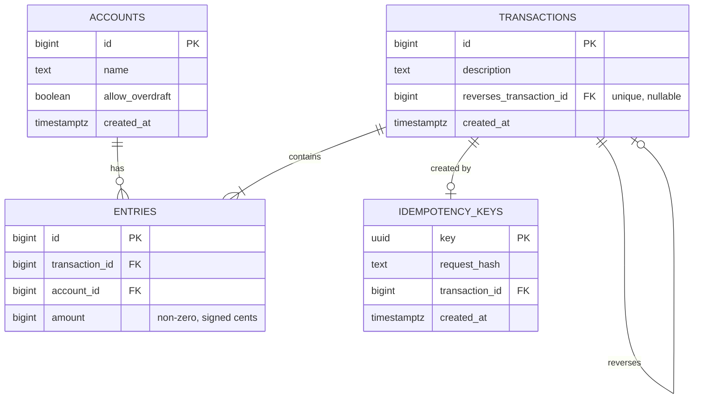

# Double-Entry Ledger API

A backend service for moving money correctly: double-entry accounting, overdraft protection, reversals, idempotent retries, and concurrency safety, built with FastAPI and PostgreSQL.

## Why this project

Most of fintech sits on top of a ledger: a record of every movement of money that must never lose, duplicate, or invent a cent, even when requests are retried or arrive at the same moment. I built this to learn those problems hands-on, and wrote the correctness-critical core by hand: transfers, overdraft rules, reversals, idempotency, and locking.

## Features

- **Double-entry accounting.** Every transaction is a set of signed entries that sum to zero. Money moves between accounts; it is never created or destroyed.
- **Derived balances.** Balances are computed from entries, never stored, so there is a single source of truth.
- **Append-only history.** Entries are never edited or deleted. Mistakes are corrected with reversals.
- **Overdraft protection.** Each account either allows or forbids a negative balance.
- **Reversals.** A transaction can be reversed exactly once, enforced by a database constraint, and reversals cannot themselves be reversed.
- **Required idempotency keys.** Every money-moving request carries a key, so a retried request posts exactly once and returns the original result.
- **Concurrency safety.** Simultaneous transfers cannot overdraw an account, verified by tests that force real race conditions.

## Tech stack

Python, FastAPI, PostgreSQL, SQLAlchemy 2.0, Alembic, Pydantic, pytest, Locust

## Running locally

**Prerequisites:** Python 3.11+, PostgreSQL

```bash
git clone github.com/daniiltsioma/double-ledger
cd double-ledger
python -m venv .venv && source .venv/bin/activate
pip install -r requirements.txt

createdb ledger
createdb ledger_test
cp .env.example .env   # then fill in your database URLs

alembic upgrade head
fastapi dev main.py
```

Open http://127.0.0.1:8000/docs for interactive API documentation.

**Run the tests:**

```bash
pytest
```

The test suite applies migrations to the test database automatically.

## API overview

<!-- TODO: confirm paths match your routes -->

| Method | Path | Description |
|---|---|---|
| `POST` | `/accounts` | Create an account (optionally allowing overdrafts) |
| `GET` | `/accounts/{id}` | Get an account and its current balance |
| `POST` | `/transfers` | Move money between two accounts |
| `POST` | `/transactions/{id}/reversal` | Reverse a transaction |

Money-moving endpoints require an `Idempotency-Key` header containing a UUID:

```bash
curl -X POST http://127.0.0.1:8000/transfers \
  -H "Content-Type: application/json" \
  -H "Idempotency-Key: 3f2a9c1e-8b4d-4f6a-9e2b-1c7d5a0f4e88" \
  -d '{"from_account_id": 1, "to_account_id": 2, "amount": 349, "description": "Red Bull"}'
```

Amounts are integer cents: `349` is $3.49.

**Error responses:**

- `422` for invalid input (missing fields, non-positive amounts, same sender and receiver, missing or malformed idempotency key, unknown accounts)
- `409` for valid requests that business rules reject (insufficient funds, a transaction already reversed, an idempotency key reused with a different request)

## Data model



A transfer of $3.49 from Alice to a shop is one row in `transactions` and two rows in `entries`: `-349` on Alice's account and `+349` on the shop's.

## Design decisions

**Integer cents, not floats.** Floats cannot represent most decimal amounts exactly. Storing cents as `BIGINT` removes rounding questions entirely.

**Signed amounts.** Negative means money leaving an account, positive means money arriving. The core rule of double-entry becomes simple: a transaction's entries sum to zero.

**Balances are derived.** Storing a balance column would create two sources of truth that could drift apart. Balances are always the sum of an account's entries.

**Reversals instead of edits.** History is immutable, which keeps a complete audit trail. A unique constraint on `reverses_transaction_id` guarantees a transaction is reversed at most once, even under simultaneous requests.

**Reversals bypass overdraft rules.** A reversal usually corrects an error, and blocking it would leave the mistake in place. This mirrors how a chargeback can push a merchant's balance negative.

**How money enters the system.** New accounts start at zero and cannot go negative by default. Accounts with `allow_overdraft` represent external sources, such as a funding account standing in for incoming deposits.

**Idempotency keys are required.** Making retries safe should not depend on every client remembering to opt in. Keys must be UUIDs, so unrelated requests cannot collide by accident.

**Idempotency lives in its own table.** It is an API reliability concern, not ledger data. Each key stores a SHA-256 hash of the canonicalized request, so reusing a key with a different request is detected and rejected.

**Failed requests do not consume their key.** The key commits atomically with the transaction, so a request that fails (for example, insufficient funds) can be retried with the same key once the problem is fixed. The trade-off: a delayed retry could succeed after the client believed the transfer had failed. Replaying stored failures, as Stripe does, avoids that at the cost of more complexity.

**Locks cover only accounts being debited.** Credits can only increase a balance, so the overdraft check only needs to protect the sender. Locks use `FOR NO KEY UPDATE` and are acquired in ascending account id order, so a transaction that ever locks several accounts cannot deadlock.

**Business rules live in a service layer.** Endpoints only handle HTTP. Services raise domain exceptions, which endpoints translate into status codes, so the rules can be tested and reused without HTTP.

## Testing

- Tests run against an isolated database with migrations applied automatically at the start of the session.
- Every test is followed by a ledger-wide invariant check: every transaction sums to zero, and all balances together sum to zero.
- Concurrency tests start threads simultaneously with `threading.Barrier`, and use `monkeypatch` to widen the window between reading a balance and writing entries, so race conditions happen on every run instead of occasionally.
- Each test was confirmed to fail with its protection removed, so the tests guard real behavior.

## Bugs my tests caught

<!-- TODO: rewrite these in your own words -->

**1. Retries rejected as insufficient funds.** The idempotency check originally ran after the balance check. A retry of a transfer that had drained an account failed with "insufficient funds" instead of returning the original result. Fix: detect replays before evaluating any business rules, since a replay is not a new transfer.

**2. A race condition hidden by test timing.** Without locking, an account funded for five transfers sometimes allowed six. The test passed at the end of the suite but failed when run alone: warmed-up connections made requests overlap less, and SQLAlchemy's connection pool serialized larger runs. Fix: row-level locking, plus a test that forces the race deterministically.

**3. Concurrent duplicates broke after adding locks.** Once transfers waited on account locks, a duplicate request queued behind the original, then saw the drained balance and failed instead of replaying. Fix: claim the idempotency key before locking, so duplicates collide on the key's unique constraint and receive the original result.

**4. A deadlock not visible in my own code.** Two accounts sending to each other deadlocked even though each transfer locked only its sender. The cause: inserting an entry makes Postgres check the foreign key with a `FOR KEY SHARE` lock on the receiver's row, which `FOR UPDATE` blocks. Fix: lock with `FOR NO KEY UPDATE`, which serializes debits without conflicting with foreign key checks.

## Load testing

A quick Locust run with 50 simulated users, comparing evenly spread traffic with a profile where 80% of transfers debit one "hot" account:

| Profile | p95 latency |
|---|---|
| Uniform | 18 ms |
| Hot account | 22 ms |

Lock contention is real but mild at this load, because each transfer holds the lock for only a few milliseconds. It would grow sharply as traffic on one account approaches the rate at which the lock can be handed off. At scale, the standard fix is splitting a hot account into several sub-accounts so debits spread across multiple locks.

## How this was built

I wrote the core business logic, schema, and tests by hand to learn the concepts deeply. I used AI assistance for supporting tooling, such as load-test scripts, and reviewed every change against tests I designed.

## Roadmap

- [ ] Docker Compose, CI with GitHub Actions, and deployment
- [ ] Pay-ins via Stripe test mode, with webhook handling
- [ ] Payouts with clearing accounts and returns
- [ ] Reconciliation against bank statement files
- [ ] Holds and pending balances
- [ ] React dashboard
